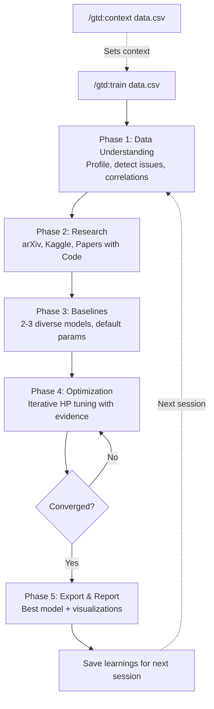
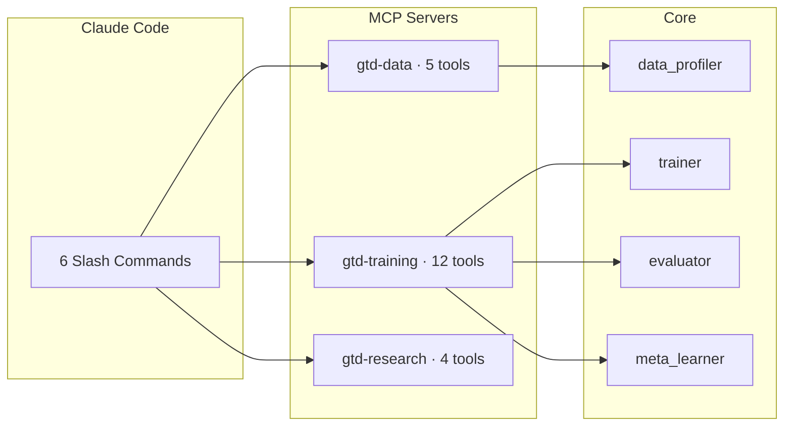

# Get Training Done

> AI-powered ML model optimization for Claude Code

[](https://github.com/yuvalshalev/get-training-done/actions/workflows/ci.yml)
[](LICENSE)
[](https://www.python.org/downloads/)
[](https://claude.com/claude-code)
[](CONTRIBUTING.md)

Train and optimize ML models the way a senior data scientist would — with data profiling, research awareness, transparent reasoning, and configurable time budgets. All from your terminal.

## Quick Start

```bash
claude plugin install https://github.com/yuvalshalev/get-training-done
```

Then:

```
/gtd:train path/to/data.csv
```

Set a time budget to control how long optimization runs:

```
/gtd:train path/to/data.csv --time 30m
```

Formats: `5m`, `30m`, `1h`, `1.5h` (default: `10m`).

That's it. GTD profiles your data, researches approaches, trains baselines, optimizes hyperparameters, and exports the best model.

## Commands

| Command | Description |
|---------|-------------|
| `/gtd:train` | Train and optimize a model on your dataset |
| `/gtd:eda` | Exploratory data analysis on your dataset |
| `/gtd:context` | Set dataset context for subsequent commands |
| `/gtd:inference` | Run predictions on new data |
| `/gtd:evaluate` | Evaluate model on labeled test data |
| `/gtd:models` | List all trained models |

## How It Works

GTD follows a 5-phase workflow, the same way a senior data scientist approaches a new problem:



Every decision is justified. The agent explains why it picked XGBoost over Random Forest, why it lowered the learning rate, and when to stop.

## Architecture



## Self-Learning

GTD saves what worked across sessions — strategies, hyperparameter sweet spots, and anti-patterns:

- **Global knowledge** at `~/.claude/gtd/` persists insights across all projects
- **Project-level** learnings stored in the workspace directory

See [docs/learning-lifecycle.md](docs/learning-lifecycle.md) for details.

## What Sets This Apart

Traditional AutoML treats hyperparameter tuning as a pure search problem. GTD uses an LLM agent that:

- **Analyzes data first** — profiles distributions, detects class imbalance, finds leakage before training
- **Researches what works** — searches arXiv and Kaggle for approaches that succeed on similar data
- **Makes informed decisions** — selects models based on data characteristics, not queue order
- **Explains everything** — every choice is justified with evidence
- **Knows when to stop** — convergence detection based on diminishing returns

## Supported Models

### Classification
| Model | Best For |
|-------|----------|
| XGBoost | Strong default for structured data |
| LightGBM | Fast training, native categorical support |
| CatBoost | High-cardinality categoricals |
| Random Forest | Robust baseline, handles noise |
| Extra Trees | High-dimensional data |
| Logistic Regression | Interpretable linear baseline |
| SVM | Small-medium datasets |
| KNN | Low-dimensional with clear clusters |
| MLP | Complex nonlinear patterns |

### Regression
All tree-based models above plus Linear Regression, ElasticNet, SVR, KNN Regressor, MLP Regressor.

## MCP Tools Reference

### Data Analysis (`gtd-data`)
- `profile_dataset` — Shape, distributions, missing values, class balance, outliers
- `get_column_stats` — Deep dive into a single column
- `detect_data_issues` — Class imbalance, multicollinearity, data leakage, high cardinality
- `compute_correlations` — Feature-target and feature-feature correlations
- `preview_data` — Quick data preview

### Model Training (`gtd-training`)
- `train_model` — Cross-validated training with any supported model
- `evaluate_model` — Full metrics (accuracy, F1, ROC-AUC, confusion matrix, etc.)
- `get_feature_importance` — Built-in or permutation importance with plots
- `get_roc_curve` / `get_pr_curve` — Curve visualizations
- `compare_runs` — Side-by-side model comparison
- `engineer_features` — One-hot encoding, imputation, scaling, interactions
- `export_model` — Save best model for deployment
- `predict` — Score new data
- `get_optimization_history` — Full run history
- `list_available_models` — All supported models and hyperparameter spaces
- `register_model` / `list_registered_models` — Model registry management

### Research (`gtd-research`)
- `search_arxiv` — Find relevant ML papers
- `search_kaggle_datasets` — Find similar datasets
- `search_kaggle_notebooks` — Find winning competition solutions
- `search_papers_with_code` — Find state-of-the-art methods

## Examples

See the [examples/](examples/) directory for detailed walkthroughs:

- [Quick Start](examples/quick_start.md) — End-to-end optimization in 5 minutes
- [Binary Classification](examples/binary_classification.md) — Churn prediction with class imbalance
- [Regression](examples/regression.md) — House price prediction

## Alternative Installation

### Interactive Plugin Manager

Inside Claude Code, type `/plugins`, then add the repo URL.

### Local Development

```bash
git clone https://github.com/yuvalshalev/get-training-done.git
claude --plugin-dir ./get-training-done
```

### From Source

```bash
git clone https://github.com/yuvalshalev/get-training-done.git
cd get-training-done
pip install -e ".[dev]"
```

## Development

```bash
# Install dev dependencies
pip install -e ".[dev]"

# Run tests
pytest tests/ -v

# Run with coverage
pytest tests/ --cov=gtd --cov-report=term-missing

# Lint
ruff check src/ tests/
```

See [CONTRIBUTING.md](CONTRIBUTING.md) for more details.

## License

MIT
